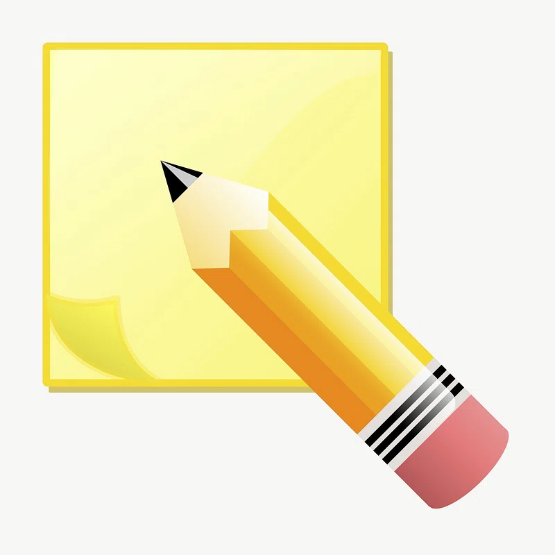

  

<h1 align="center" style="margin-top: -10px"> Sketch! </h1>

   Drawing game/prompt generator. 
   First Edition, June 2023

## Pre-Requisites
- (If you're using the source code) Python 3
- (Optional) a text editor

## Installation & Setup

### From Release
1. Download the Windows or Linux release.
2. Put the contents wherever you like, preferably somewhere that's easy to get to in your terminal. For Windows users, I'd recommend `C:/Users/user` because it's not uncommon for software and CMD will probably start there. A desktop shortcut might be handy.

### From Source
1. Clone or download this repository and do what you wish with the code.
2. To build, run either `build-Windows` or `build-Linux`.
3. Move the `/release` contents to wherever you like.

> Just be sure the `Sketch-Library` folder is in the same directory as the script or executable. I encourage you to add your own content to those files to expand the game.

## How it Works:
Number of players: **1+**  
Objective: **Try to draw ideas generated by the game**

An idea will be a combination of a **subject(s)**, a **modifier**, **an action**, and an **environment**.

The `/Sketch-Library` folder contains files with lists of possibilities. There's a ton of content already here, but I encourage you to add more of your own. Just be sure to go along with the example content's format and use case. If you're unsure, think like this:

- *Subject(s)* will be a character, a thing, or idea.
- *Modifiers* will describe the subject; sometimes physical, sometimes a trait, sometimes a mood.
- *Actions* will be something for your subject to be doing.
- *Environments* [self explanatory] are the surroundings for your subject to be in.

## Play
To play an idea, run the file `Sketch` in a terminal of your choice. As long as the `Sketch-Library` folder from the source/release is in the same directory, it will generate a prompt from its contents. Now, try to draw it! Play again and again for different results. Sometimes the generated idea won't make sense - that's okay. It's up to you to get creative and make it happen.

## Credits
Written by telekrex. Please direct any suggestions, questions, or suspected security vulnerabilities to telekrex@gmail.com.